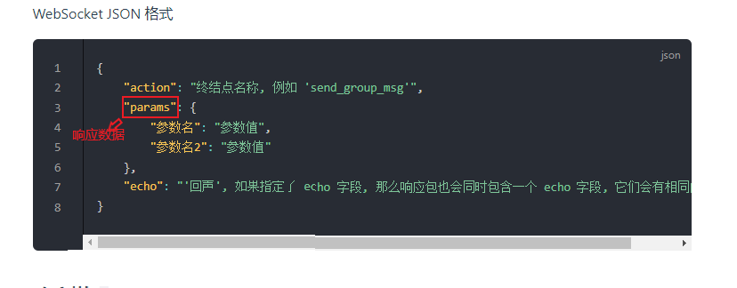

# 导入接口

由于路径不同，接口文件的引用路径也会发生改变。

## 对于插件内部的扩展插件
```javascript
const { botEvent, apiExecute, apiExecute_sync } = require("../../API.js")
```
## 对于本插件外部的插件
```javascript
const { botEvent, apiExecute, apiExecute_sync } = require("../AgateBot/API.js")
```

# 引入补全文件

由于接口数量过多，只有`apiExecute_sync`和`botEvent`有较全的补全，`apiExecute`则没有设置补全。

在你的插件开头加入这一行引入补全：
```typescript
/// <reference path="补全文件路径.../api.d.ts"/>
```

release压缩包中会包含一个`api.d.ts`文件。

# API

可以用`apiExecute_sync`和`apiExecute`两种方式调用。

### 同步调用一个API（更常用）
`apiExecute_sync(action,params[,echo])`

-参数：
  - action : `string`  
    要执行的API名（见[机器人插件文档](https://llonebot.github.io/zh-CN/develop/api)）
    对于所有API，都可以可以在API名称后面加上后缀 `_rate_limited`或`_async`来[限速调用或异步调用](https://github.com/botuniverse/onebot-11/tree/master/api)

  - params : `object`  
    调用API时传入的一系列参数
    参数内容视不同API而定

  - echo : `string`  
    用于唯一标识一次调用请求，若不填会自动生成一个随机数，防止请求回复的结果撞车
- 返回值：API调用后返回的[响应数据](https://docs.go-cqhttp.org/api/#%E5%9F%BA%E7%A1%80%E4%BC%A0%E8%BE%93)，如果请求错误，返回null
- 返回值类型：`object | null` 

来自gocq文档：



### 异步调用一个API
`apiExecute(action,params,callback,[,echo])`

-参数：
  - action : `string`  
    要执行的API名（见[机器人插件文档](https://llonebot.github.io/zh-CN/develop/api)）
    对于所有API，都可以可以在API名称后面加上后缀 `_rate_limited`或`_async`来[限速调用或异步调用](https://github.com/botuniverse/onebot-11/tree/master/api)

  - params : `object`  
    调用API时传入的一系列参数
    参数内容视不同API而定
  - callback : `Function`  
    在API调用后自动执行的回调函数
    会传入一个带有[响应数据](https://docs.go-cqhttp.org/api/#%E5%9F%BA%E7%A1%80%E4%BC%A0%E8%BE%93)的对象
  - echo : `string`  
    用于唯一标识一次调用请求，若不填会自动生成一个随机数，防止请求回复的结果撞车
- 返回值：执行结果Object
- 返回值类型：Object<Boolean,String>

  - 对于返回的某个执行结果对象res，有如下这些成员：  

  | 成员        | 含义                    | 类型      |
  | ----------- | ----------------------- | --------- |
  | res.success | 是否执行成功            | `Boolean` |
  | res.reason  | 错误讯息，当且仅当调用失败时有 | `String`  |

# 事件监听

### 注册监听器  

`botEvent.listen(event,callback)`

- 参数：

  - event : `String`  
    要监听的事件名（见[机器人文档](https://llonebot.github.io/zh-CN/develop/event)）

  - callback : `Function`  
    注册的监听函数  
    当指定的事件发生时，自动调用你给出的监听函数，并传入含对应参数的对象，参数视事件而不同
- 返回值：无
- 返回值类型：`void` 

# 建议参考的文档：

[机器人文档](https://llonebot.github.io/zh-CN/develop/api)

[gocq文档](https://docs.go-cqhttp.org/api/#%E8%AF%B7%E6%B1%82%E8%AF%B4%E6%98%8E)

[onebot-11](https://github.com/botuniverse/onebot-11)
