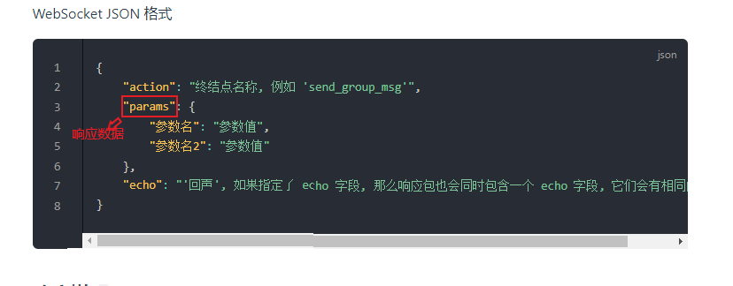

Certainly! Here's the translation of your text:

# Importing Interfaces

Since the paths are different, the reference paths for interface files will also change.

## For extension plugins within the plugin
```javascript
const { botEvent, apiExecute, apiExecute_sync } = require("../../API.js")
```

## For plugins outside of this plugin
```javascript
const { botEvent, apiExecute, apiExecute_sync } = require("../AgateBot/API.js")
```

Certainly! Here's the translation of the content:

# Importing Completion Files

Since there are numerous interfaces, only `apiExecute_sync` and `botEvent` have comprehensive completions. `apiExecute` does not have completion set.

To enable better code completion in your plugin, add the following line at the beginning of your plugin:

```typescript
/// <reference path="path_to_completion_file.../api.d.ts"/>
```

The release package should contain an `api.d.ts` file.

# API

You can call APIs using either `apiExecute_sync` or `apiExecute`.

### Synchronous API Call (More Common)
`apiExecute_sync(action, params[, echo])`

- Parameters:
  - `action`: `string`
    The name of the API to execute (see [Bot Plugin Documentation](https://llonebot.github.io/zh-CN/develop/api))
    For all APIs, you can add the suffix `_rate_limited` or `_async` after the API name to [limit or asynchronously call](https://github.com/botuniverse/onebot-11/tree/master/api).

  - `params`: `object`
    A series of parameters to pass when calling the API. The specific parameters depend on the API.

  - `echo`: `string`
    Used to uniquely identify a call request. If not provided, a random number will be generated to prevent collisions in response results.
- Return value: The response data returned after calling the API ([documentation](https://docs.go-cqhttp.org/api/#%E5%9F%BA%E7%A1%80%E4%BC%A0%E8%BE%93)). If there is an error in the request, `null` is returned.
- Return value type: `object | null`

Pic From the GoCQ documentation:



### Asynchronous API Call
`apiExecute(action, params, callback[, echo])`

- Parameters:
  - `action`: `string`
    The name of the API to execute (see [Bot Plugin Documentation](https://llonebot.github.io/zh-CN/develop/api)).
    For all APIs, you can add the suffix `_rate_limited` or `_async` after the API name to [limit or asynchronously call](https://github.com/botuniverse/onebot-11/tree/master/api).

  - `params`: `object`
    A series of parameters to pass when calling the API. The specific parameters depend on the API.

  - `callback`: `Function`
    The callback function to be automatically executed after the API call.
    It will receive an object containing the [response data](https://docs.go-cqhttp.org/api/#%E5%9F%BA%E7%A1%80%E4%BC%A0%E8%BE%93).
  - `echo`: `string`
    Used to uniquely identify a call request. If not provided, a random number will be generated to prevent collisions in response results.
- Return value: An object representing the execution result.
- Return value type: `Object<Boolean, String>`

  - For a specific execution result object `res`, it has the following members:

  | Member       | Meaning                  | Type      |
  | ------------ | ------------------------ | --------- |
  | `res.success`| Whether the execution was successful | `Boolean` |
  | `res.reason` | Error message (only present when the call fails) | `String` |

# Event Listening

### Registering Listeners

`botEvent.listen(event, callback)`

- Parameters:

  - `event`: `String`
    The name of the event to listen for (see [Bot Documentation](https://llonebot.github.io/zh-CN/develop/event)).

  - `callback`: `Function`
    The listener function to register.
    When the specified event occurs, your provided listener function will be automatically called with an object containing relevant parameters (specific to the event).
- Return value: None
- Return value type: `void`

# Recommended Reference Documentation:

[Bot Documentation](https://llonebot.github.io/zh-CN/develop/api)

[GoCQ Documentation](https://docs.go-cqhttp.org/api/#%E8%AF%B7%E6%B1%82%E8%AF%B4%E6%98%8E)

[onebot-11](https://github.com/botuniverse/onebot-11)
